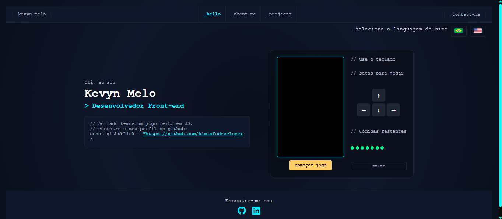
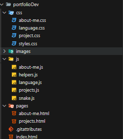
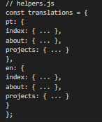

# 🌐 Personal Portfolio Website

Bem-vindo ao repositório do meu **Portfólio Pessoal**, um projeto moderno e multilíngue desenvolvido com HTML, CSS e JavaScript. Ele destaca meus projetos, habilidades, e trajetória profissional — tudo com um visual escuro moderno e interativo.

## 📸 Preview

## Acesse ➡️ https://kiminfodeveloper.github.io/portfolioDev/index.html

## ✨ Funcionalidades

-   🌍 **Suporte a múltiplos idiomas** (Português 🇧🇷 e Inglês 🇺🇸)
-   🧑‍💻 Página "Sobre Mim" com abas dinâmicas (bio, interesses, formações)
-   🗂️ Página de projetos com cards organizados e responsivos
-   🌓 Tema escuro com visual neon e fontes monoespaçadas
-   📱 Design responsivo para todos os dispositivos
-   📁 Estrutura modular para fácil manutenção e expansão

## 🗂️ Estrutura de Pastas

## 🌐 Tradução

O projeto usa um sistema de tradução simples em JavaScript que detecta o idioma salvo no localStorage e aplica dinamicamente os textos

## 🚀 Como Executar Localmente

Clone o repositório:

git clone https://github.com/seu-usuario/seu-repositorio.git
Abra o arquivo index.html no seu navegador.

Nenhum servidor local é necessário, já que o projeto é totalmente estático.

## 🛠️ Tecnologias Utilizadas

HTML5

CSS3 (com variáveis e design responsivo)

JavaScript (manipulação de DOM, localStorage, e modularização)

## 📌 Possíveis Melhorias Futuras

Suporte a mais idiomas

Animações com Framer Motion ou GSAP

Sistema de temas (claro/escuro) com botão de alternância

SEO otimizado e meta tags dinâmicas

## 📄 Licença

Este projeto está sob a licença MIT. Veja o arquivo LICENSE para mais detalhes.

## 👨‍💻 Desenvolvido por Kevyn Melo
